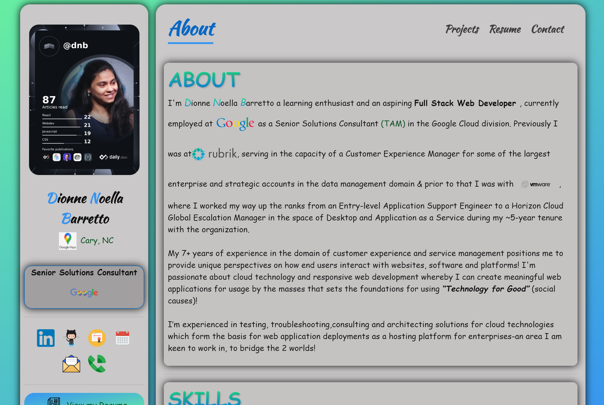
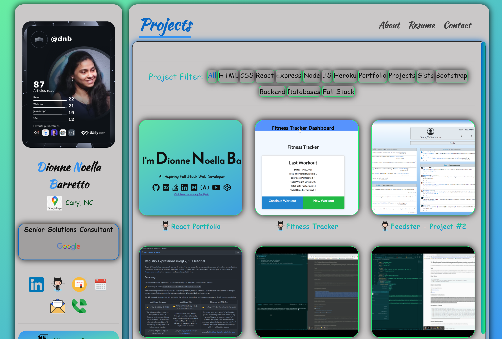
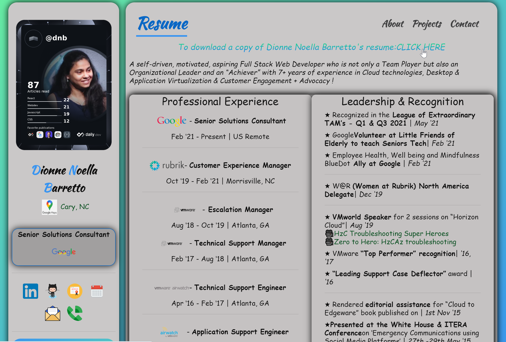
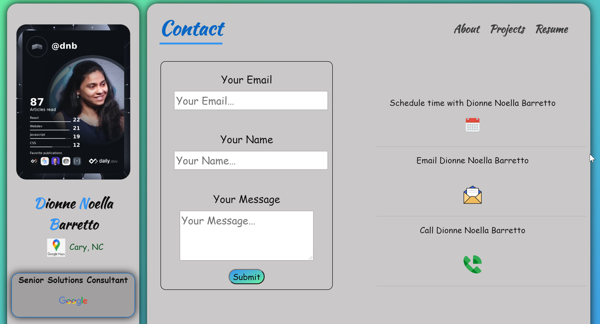
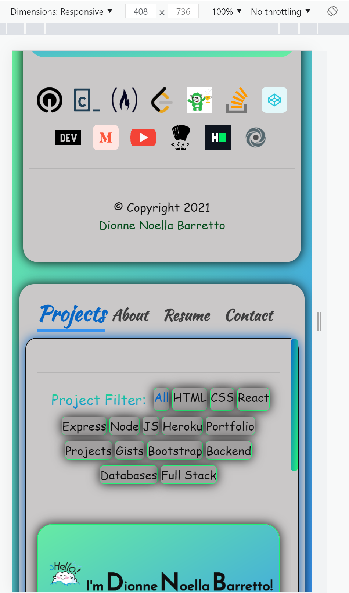
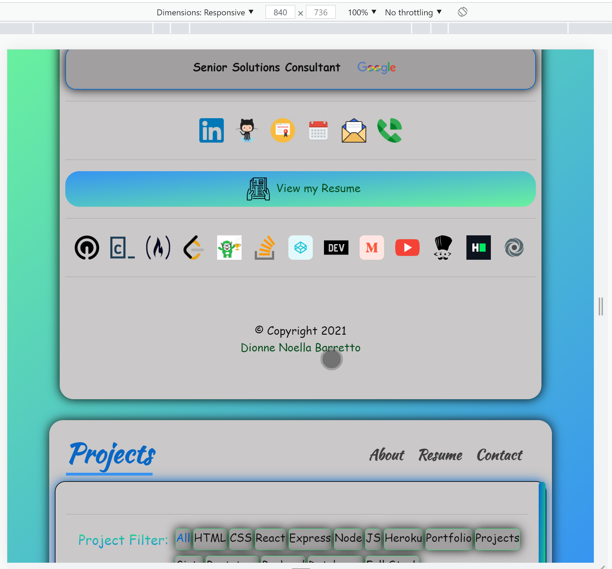

# 20 React: React Portfolio

## Task

Task is to create a portfolio deployed in Github Pages [Instructions: Create React App Docs on GitHub Pages](https://create-react-app.dev/docs/deployment/#github-pages) using React frontend framework, which will help set my portfolio apart from other developers whose portfolios don’t use the latest technologies! 


--------------------------------
# DNB's SOLUTION: 

## UNC Boot Camp Submission: 

🗂️ [Github Repository](https://github.com/DionneNoellaBarretto/20_DNB_React_Portfolio/settings/pages) | 📄[Readme Page](https://dionnenoellabarretto.github.io/20_DNB_React_Portfolio/) 

📑[Deployed Netlify Page](https://dnb-react-portfolio.netlify.app/) | [](https://app.netlify.com/sites/dnb-react-portfolio/deploys)

[WireFrame - Layout](https://drive.google.com/file/d/1NIMF139VHox3gRsoGtBnzCC6UeaWHBsV/view?usp=sharing)

--------------------------------

## User Story

```
AS AN employer looking for candidates with experience building single-page applications
I WANT to view a potential employee's deployed React portfolio of work samples
SO THAT I can assess whether they're a good candidate for an open position
```

## Acceptance Criteria

```
GIVEN a single-page application portfolio for a web developer
✓ WHEN I load the portfolio THEN I am presented with a page containing a header, a section for content, and a footer
✓ WHEN I view the header THEN I am presented with the developer's name and navigation with titles corresponding to different sections of the portfolio
✓ WHEN I view the navigation titles THEN I am presented with the titles About Me, Portfolio, Contact, and Resume, and the title corresponding to the current section is highlighted
✓ WHEN I click on a navigation title THEN I am presented with the corresponding section below the navigation without the page reloading and that title is highlighted
✓ WHEN I load the portfolio the first time THEN the About Me title and section are selected by default
✓ WHEN I am presented with the About Me section THEN I see a recent photo or avatar of the developer and a short bio about them
✓ WHEN I am presented with the Portfolio section THEN I see titled images of six of the developer’s applications with links to both the deployed applications and the corresponding GitHub repositories
✓ WHEN I am presented with the Contact section THEN I see a contact form with fields for a name, an email address, and a message
✓ WHEN I move my cursor out of one of the form fields without entering text THEN I receive a notification that this field is required
✓ WHEN I enter text into the email address field THEN I receive a notification if I have entered an invalid email address
✓ WHEN I am presented with the Resume section THEN I see a link to a downloadable resume and a list of the developer’s proficiencies
✓ WHEN I view the footer THEN I am presented with text or icon links to the developer’s GitHub and LinkedIn profiles, and their profile on a third platform (Stack Overflow, Twitter)
```

### Mockup - Desktop, Tablet & Mobile Views
The following images show the web application's appearance and functionality:

Landing Page (Desktop) hosted on github: <br>
 <br>
About/Skills Page: <br>
 <br>
Projects Page: <br>
 <br>
Resume Page: <br>
 <br>
Contact Page: <br>
 <br>
Tablet/Mobile View: <br>

 <br>

## Technologies Used
HTML, CSS (Bootstrap), JavaScript, React (frontend framework), External Libraries: Framer Motion (animation), React Router (routing), GithubPages


## Grading Requirements

This homework is graded based on the following criteria:

### Technical Acceptance Criteria: 40%

 Satisfies all of the preceding acceptance criteria plus the following:
```
✅Application must use React to render content.
✅Application has a single `Header` component that appears on multiple pages, with a `Navigation` component within it that’s used to conditionally render About Me, Portfolio, Contact, and Resume sections.
✅Application has a single `Project` component that’s used multiple times in the Portfolio section.
✅Application has a single `Footer` component that appears on multiple pages.
✅Application must be deployed to GitHub Pages.
```
### Deployment: 32%
```
✅Application deployed at live URL.
✅Application loads with no errors.
✅Application GitHub URL submitted.
✅GitHub repository contains application code.
```
### Application Quality: 15%
```
✅User experience is intuitive and easy to navigate.
✅User interface style is clean and polished.
✅Application uses a color scheme other than the default Bootstrap color palette.
```
### Repository Quality: 13%
```
✅Repository has a unique name.
✅Repository follows best practices for file structure and naming conventions.
✅Repository follows best practices for class/id naming conventions, indentation, quality comments, etc.
✅Repository contains multiple descriptive commit messages.
✅Repository contains high-quality README file with description, screenshot, and link to deployed application.
```

